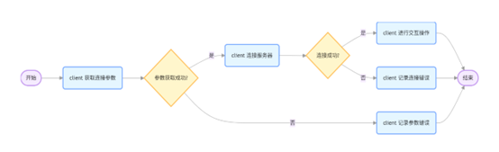
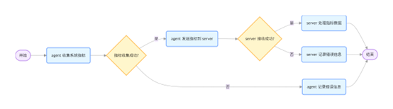
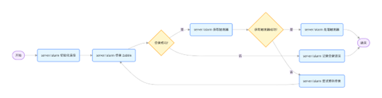
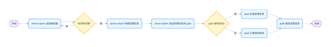
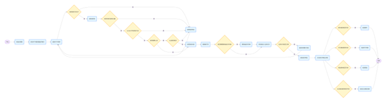

# Vigilix 项目详细介绍


## 一、项目概述

Vigilix 项目是一个具备多组件、多功能的系统，主要用于自动巡检、系统监控、数据推送以及告警处理等。该项目包含客户端、推送端、代理端和服务端等多个模块，各模块协同工作，实现系统信息的采集、处理和通知功能。同时，项目还集成了 Zabbix 告警、巡检表格生成等特色功能，为运维人员提供全面的系统监控解决方案。

## 二、项目组成架构

### 1. 整体架构

项目主要由以下几个部分组成：

- **客户端（Client）**：负责与用户进行交互，实现用户登录和命令执行等功能。
- **推送端（Push）**：根据配置将信息推送给不同的接收方，如邮件、钉钉、短信、企业微信等（轻量级、并发强、可对接第三方平台进行推送数据）。
- **代理端（Agent）**：部署在被监控的主机上，负责采集主机的系统指标数据，并将数据发送给服务端。
- **服务端（Server）**：接收代理端发送的数据，进行处理和存储，同时处理系统信号和告警信息（可对接zabbix接口收集触发器情况，如有异常，触发告警）。

### 2. 目录结构

```plaintext
client/ # 此模块功能目前实现登录后push自定义消息，尚未完善，仅作参考
push/
agent/
server/
```

### 3. 时序图


## 三、采用的技术栈

### 1. 编程语言

- **Go 语言**：项目主要使用 Go 语言进行开发，具有高效、并发性能好等特点。

### 2. 依赖库

- **[github.com/gorilla/websocket](https://github.com/gorilla/websocket)**：用于实现 WebSocket 通信，在客户端、服务端和代理端中都有使用。
- **[github.com/shirou/gopsutil](https://github.com/shirou/gopsutil)**：用于采集系统指标数据，如 CPU、内存、磁盘等信息。
- **gopkg.in/yaml.v3**：用于解析 YAML 配置文件，方便项目的配置管理。
- **[github.com/jmoiron/sqlx](https://github.com/jmoiron/sqlx)**：用于数据库操作，服务端使用该库与数据库进行交互。
- **[github.com/xuri/excelize/v2](https://github.com/xuri/excelize/v2)**：用于处理 Excel 文件，服务端可能会使用该库进行数据导出等操作。

## 四、对接的接口数据

### 1. Push推送端对外接口

Push 支持通过 POST 方式对接 Server 服务端，实现告警及数据推送。该推送端具备轻量级架构、高并发处理能力和优异性能，同时也支持接收第三方平台的数据推送。推送数据结构体如下：

**自定义消息推送**

| **字段名** | **类型** | **说明**      |
| ---------- | -------- | ------------- |
| Type       | Int      | 推送类型（1） |
| Content    | Any      | 推送内容      |

**自定义告警模板推送**

| **顶层字段名**     | **类型** | **说明**      |
| ------------------ | -------- | ------------- |
| Type               | int      | 推送类型（2） |
| Content            | []byte   | 主机信息      |
| Content.HostName   | string   | 主机名        |
| Content.IpAddr     | string   | 主机IP        |
| Content.AlertTime  | string   | 告警时间      |
| Content.Message    | string   | 告警描述      |
| Content.MetricType | string   | 告警类型      |
| Content.Current    | float64  | 当前阈值      |
| Content.Partition  | string   | 分区          |
| Content.State      | string   | 状态          |

### 2. 客户端与服务端

客户端通过 WebSocket 与服务端进行通信，客户端发送登录信息和命令，服务端接收并处理这些信息。客户端登录信息结构体如下：

| **字段名** | **类型** | **说明**   |
| ---------- | -------- | ---------- |
| Username   | string   | Client账号 |
| Password   | string   | Client密码 |
| Command    | string   | 命令 参数  |

### 3. 推送端与第三方平台

推送端根据配置将信息推送给不同的第三方平台，如邮件、钉钉、短信、企业微信等。推送端配置文件（`push/config/config.yaml`）中包含了与这些平台对接的相关信息，如发件人邮箱、SMTP 服务器地址、钉钉机器人 Webhook URL 等。


## 五、各个模块相互配合的流程

### 1. 客户端与服务端交互流程



1. 客户端启动，读取配置文件，建立与服务端的 WebSocket 连接。
2. 客户端发送登录信息（用户名、密码、命令）给服务端。
3. 服务端接收登录信息，进行身份验证。
4. 如果验证通过，服务端处理客户端发送的命令，并返回处理结果给客户端；如果验证不通过，返回错误信息。

### 2. 代理端与服务端交互流程



1. 代理端启动，读取配置文件，建立与服务端的 WebSocket 连接。  
2. 代理端根据服务端通知采集主机的系统指标数据。  
3. 代理端将采集到的数据发送给服务端。  
4. 服务端接收数据，进行处理和存储。  
5. 代理端还可用来实现基础的性能监控，将超阈值的指标封装为告警信息发至服务端

### 3. 服务端与 zabbix 交互流程 



1. **初始化连接** 
服务端加载 Zabbix API 配置（URL、用户名、密码），创建 HTTP 客户端并发送登录请求。 
2. **身份验证** 
Zabbix 返回认证令牌（token），服务端保存该 token 用于后续 API 调用。 
3. **数据获取** 
服务端使用 token 发送请求获取触发器、主机等监控数据（如触发中的告警列表）。 
4. **数据转换** 
将 Zabbix 格式的数据（如触发器对象）转换为内部告警对象，关联主机信息。 
5. **状态比对** 
对比 Zabbix 端与本地缓存的告警状态，识别新增、恢复或级别变更的告警。 
6. **告警生成** 
为状态变化的监控项创建告警事件，附加详细信息（如触发时间、影响范围）。 
7. **错误处理** 
若 API 调用失败（如 token 过期），自动重新认证或设置重试策略（如指数退避）。 
8. **会话管理** 
定期检查 token 有效性，在过期前自动刷新认证状态。 
9. **定时同步** 
按配置周期重复上述流程，持续更新监控状态。 

### 4. 服务端与推送端交互流程



1. 服务端在处理数据过程中，如果检测到告警信息（包括系统指标阈值告警和 Zabbix 告警），触发推送机制。
2. 服务端将告警信息（包括告警类型、时间、详细描述等）发送给推送端。
3. 推送端接收告警信息，读取配置文件，根据配置选择合适的通知方式（邮件、钉钉、短信、企业微信等）。
4. 推送端根据配置准备相应的通知内容，如邮件的主题、正文，钉钉消息的格式等。
5. 推送端按照配置的参数（如 SMTP 服务器地址、钉钉机器人 Webhook URL 等）与第三方平台进行通信，发送通知。
6. 推送端记录通知发送结果（成功或失败），并将结果反馈给服务端。
7. 服务端记录推送结果，必要时进行重试或采取其他措施。

### 5. 推送端的独立工作流程



1. 推送端启动，读取配置文件，初始化与第三方平台的连接。
2. 推送端监听来自服务端的消息，等待告警信息或其他需要推送的内容。
3. 执行主要的推送任务，如发送邮件、钉钉消息、企业微信、短信等。
4. 记录整个过程的执行结果到日志中。

## 六、特色功能详解

### 1. Zabbix 告警集成功能

#### 功能概述

Zabbix 是一款广泛使用的开源监控系统，Vigilix 项目通过集成 Zabbix 告警功能，能够从 Zabbix 获取告警信息，并通过自身的推送机制（邮件、钉钉、短信、企业微信等）将告警信息发送给相关人员。

#### 配置与实现

配置文件 `server/config/config.yaml` 中包含 Zabbix 告警相关配置：

```yaml
ZabbixAlarm:
  Status: true                  	# 是否启用 Zabbix 告警功能
  EnableDebug: false            	# 是否启用调试模式
  ZabbixURL: "http://127.0.0.1"		# Zabbix API URL
  ZabbixUser: "******"          	# Zabbix 用户名
  ZabbixPass: "******"          	# Zabbix 密码
  GetIntervalMin: 1m            	# 获取告警的最小间隔时间
  GetIntervalMax: 5m            	# 获取告警的最大间隔时间
```

#### 工作流程

1. 服务端启动时，根据配置初始化 Zabbix 告警模块。
2. 定时任务触发，服务端向 Zabbix API 发送请求，获取最新告警信息。
3. 服务端对获取到的告警信息进行处理，提取关键信息。
4. 服务端将处理后的告警信息发送给推送端。
5. 推送端根据配置将告警信息推送给相关人员。

### 2. 自动化巡检：巡检表格生成功能

#### 功能概述

Vigilix 项目支持生成巡检表格，将系统监控数据以xlsx表格形式呈现，方便运维人员进行巡检和分析。

#### 配置与实现

配置文件 `server/config/config.yaml` 中包含表格生成相关配置：

```yaml
Table:
  Status: true                  # 是否启用表格生成功能
  TablePaths: "tables/"         # 表格保存路径
```

实现方式：

```
# 全量采集通知  
curl http://Server_IP:端口/CollectInformation  
# 指定 agent 采集，例如采集ID为1和2：
curl http://Server_IP:端口/CollectInformation?clientID=1&clientID=2 
```

#### 工作流程

1. 服务端通知 Agent 进行推送数据。
2. 收集 Agent 发送的系统指标数据，服务端开始生成巡检表格。  
3. 服务端将收集到的数据按预设格式整理，并写入 Excel 文件。  
4. Excel 文件保存到配置指定的路径，可供运维人员下载和查看。

### 3. 告警阈值与通知机制

#### 功能概述

Vigilix 项目支持设置告警阈值，当系统指标超过阈值时触发告警，并通过多种方式通知相关人员。

#### 配置与实现

配置文件 `agent/config/config.yaml` 中包含告警相关配置：

```yaml
Alarm:
  Status: true                  # 是否启用告警功能
  Threshold: 80.0               # 告警阈值（百分比）
  CheckInterval: 10s            # 检查间隔时间
  NetworkCard: "eth0"           # 监控的网卡名称
  Queue: 10                     # 告警队列大小
```

#### 工作流程

1. 代理端启动时，根据配置初始化告警模块。
2. 代理端按指定间隔时间采集系统指标数据。
3. 将采集到的数据与阈值进行比较，若超过阈值则生成告警信息。
4. 代理端将告警信息发送给服务端。
5. 服务端接收告警信息，并转发给推送端。
6. 推送端根据配置选择合适的通知方式（邮件、钉钉、短信、企业微信等）发送告警信息。

### 4. 客户端工具命令执行功能

#### 功能概述

Vigilix 项目的客户端支持执行各种命令，并将命令执行结果返回给用户。

#### 配置与实现

配置文件 `server/config/config.yaml` 中包含客户端工具相关配置：

```yaml
ClientTool:
  Status: true                  # 是否启用客户端工具功能
  DatabaseOrConfigurationFile: false  # 是否从数据库或配置文件获取客户端配置
  ClientConfig:
    "user1": "PASSWORD"           # 客户端用户名和密码（明文或加密）
    "user2": "PASSWORD"
```

#### 工作流程

1. 客户端启动后，建立与服务端的 WebSocket 连接。
2. 客户端发送登录信息（用户名、密码、命令）给服务端。
3. 服务端验证客户端身份，若验证失败则返回错误信息。
4. 若验证成功，服务端执行客户端发送的命令。
5. 服务端将命令执行结果返回给客户端。
6. 客户端接收并显示命令执行结果。

### 5. 数据库集成功能

#### 功能概述

Vigilix 项目支持与数据库集成，将系统监控数据存储到数据库中，方便后续查询和分析。

#### 配置与实现

配置文件 `server/config/config.yaml` 中包含数据库相关配置：

```yaml
Database:
  DatabaseIP: "127.0.0.1"          # 数据库 IP 地址
  DatabasePort: 3306            # 数据库端口
  DatabaseName: "vigilix"        # 数据库名称
  DatabaseUser: "root"        # 数据库用户名
  DatabasePass: "PASSWORD"        # 数据库密码
  DatabaseParameter: "charset=utf8mb4&parseTime=True&loc=Local"  # 数据库连接参数
```

#### 工作流程

1. 服务端启动时，根据配置初始化数据库连接（保存数据至内存中，处理性能高，数据库宕机不影响程序运行）。
2. 服务端接收代理端发送的系统指标数据。
3. 服务端将数据存储到数据库中。
4. 当客户端请求查询数据时，服务端从数据库中获取数据。
5. 服务端将查询结果返回给客户端。

### 6. 前置和后置命令功能（不常用）

#### 功能概述

Vigilix 项目的推送端支持配置前置和后置命令，在执行主要任务前后执行额外的命令。

#### 配置与实现

配置文件 `push/config/config.yaml` 中包含前置和后置命令相关配置：

```yaml
BeforeAndAfterCommands:         # 设置执行脚本之前和之后需要执行的命令
  BeforeStatus: false           # 前置命令状态：false-关闭，true-开启
  BeforeStatusCommand:          # 前置命令
    - "echo"
    - "启动前运行"
  AfterStatus: false            # 后置命令状态：false-关闭，true-开启
  AfterCommand:                 # 后置命令
    - "echo"
    - "执行完成"
```

#### 工作流程

1. 推送端接收到需要处理的消息。
2. 检查前置命令状态，若启用则执行前置命令。
3. 执行主要任务（如发送邮件、钉钉消息等）。
4. 检查后置命令状态，若启用则执行后置命令。
5. 将整个过程的执行结果记录到日志中。

## 七、使用方法

### 1. 配置文件

项目各模块都有相应的配置文件，主要采用 YAML 格式。以下是部分配置文件的说明：

- **`push/config/config.yaml`**：推送端配置文件，包含状态配置、日志配置、监听配置、内容配置、邮件配置、钉钉配置、短信配置、企业微信配置等。

```yaml
# 状态配置
Status:
  Mail: false       # 邮件通知：false-关闭，true-开启
  DingDing: false   # 钉钉通知：false-关闭，true-开启
  SMS: false       # 短信通知：false-关闭，true-开启
  EnterpriseWeChat: true  # 企业微信通知：false-关闭，true-开启

# 日志配置
LogGer:
  Status: true  # 日志总控制
  OutStatus: true # 是否控制台输出
  FileStatus: true # 是否日志文件控制
  LogFile: logs/  # 日志保存目录
 
 # 是否开启HTTP监听，通过json请求进行推送
Listening:
  Status: true        # 是否开启监听
  Port: "8080"        # 监听端口
  LineBreaksStatus: true  # 是否需要换行
  LineBreaks: ","     # 传输数据换行符（LineBreaksStatus为true时生效）
  MaxWorkers: 8     # 最大并发工作协程数（注意：不是最大并发，设置合理即可）建议：CPU 密集型：Worker ≈ CPU 核心数；I/O 密集型：Worker = CPU 核心数 × 2~5
  QueueSize: 100000    # 任务队列容量
  WorkerTimeout: 30s  # 单个任务超时时间
  AuthenticationStatus: false # 是否开启鉴权（开启后当收到未包含鉴权关键字的不推送）
  AuthenticationKeyword: "IP" # 鉴权关键字，AuthenticationStatus为true时生效
  DeleteStringStatus: true  # 是否在接收数据中删除指定字符串
  DeleteString: "{}'"  # 需要删除的字符串，DeleteStringStatus为true时生效

# 内容配置
ContentS:
  Type: 2       # 内容类型：0:从各自配置获取内容；1:从File文件内获取内容；2:统一内容:Content
  File: "data/output.txt"  # 内容输出文件路径
  Content: "统一内容测试"  # 统一内容，Listening-Status打开时不生效

# 邮件配置
Mail:
  SenderEmail: "******@qq.com"  # 发件人邮箱
  SenderPassword: "PASSWORD"  # 发件人邮箱密码（或授权码）
  SmtpServer: "smtp.qq.com:587"  # SMTP 服务器地址
  ReceiverEmail: "******@163.com"  # 收件人邮箱
  CcEmails: # 抄送人邮箱列表
    - "******@163.com"
    - "******@163.com"
  Subject: "邮件主题"  # 邮件主题
  Body: "邮件内容测试"  # 邮件正文

# 钉钉配置
DingDing:
  WebhookURL: "https://oapi.dingtalk.com/robot/send?access_token=******"  # 钉钉机器人 Webhook URL
  Secret: "SEC******"  # 钉钉机器人 Secret
  Message: "钉钉测试内容"  # 钉钉消息内容

# 短信配置
SMS:
  Type: 0  # 短信类型：0-SGIP 协议,1-调用命令
  # Type：0时生效
  Sgip:
    LoginName: "USER"  # SGIP 登录用户名
    LoginPassword: "PASSWORD"  # SGIP 登录密码
    SmgIpPort: "127.0.0.1:3333"  # SGIP 服务器地址和端口
    SPNumber: "10******"  # SP 号码
    ChargeNumber: "000000000000000000000"  # 计费号码
    UserNumber:  # 被叫号码
      - "16600000000"
      - "15500000000"
    CorpID: "12345"  # 企业代码
    ServiceType: "123456"  # 业务类型代码
    Message: "短信测试"  # 短信内容
  
  # Type：1时生效
  Command:  # 短信发送命令
    - "java"
    - "./SgipSend"

# 企业微信配置
EnterpriseWeChat:
  WebhookURL: "https://qyapi.weixin.qq.com/cgi-bin/webhook/send?key=******"
  Message: "企业微信测试"
  AteSpecifyStatus: false # 是否@指定人
  MentionedMobileList:  # @指定人（AteSpecifyStatus为true生效）：输入"手机号"，或者 "@all"：@所有人
    - ""
    - ""

# 前置和后置命令配置
BeforeAndAfterCommands: # 设置执行脚本之前和之后需要指定的命令
  BeforeStatus: false  # 前置命令状态：false-关闭，true-开启
  BeforeStatusCommand:  # 前置命令
    - "bash"
    - "scripts/test.sh"
  AfterStatus: false  # 后置命令状态：false-关闭，true-开启
  AfterCommand:   # 后置命令
    -
```

- **`agent/config/config.yaml`**：代理端配置文件，包含服务端地址、代理 ID、认证密钥、日志配置、告警配置等。

```yaml
ServerAddr: "ws://127.0.0.1:8080"	# 服务器地址
AgentId: 1					# 当前agent_ID
AuthenticationKey: "PASSWORD"	# 当前agent鉴权密钥
ReconnectTime: 5s			# 重连时间间隔
LogGer:						# 日志配置
  Status: true				# 日志总控制
  OutStatus: true			# 是否控制台输出
  FileStatus: true			 # 是否日志文件控制
  LogFile: "logs/"			# 日志输出路径
Alarm:						# 自带告警（程序自带监控，目前支持Inode节点、磁盘、CPU、内存告警）
  Status: true				# 是否开启告警
  Threshold: 80.0			 # 阈值%
  CheckInterval: 10s		# 监控间隔,单位：s为秒，m为分钟
  NetworkCard: "eth0"		# 当前主机的网卡名称
  Queue: 10					# 告警队列数量
```

- **`server/config/config.yaml`**：服务端配置文件，包含 WebSocket 配置、表格配置、代理配置、日志配置、推送配置、客户端工具配置、Zabbix 告警配置、数据库配置等。

```yaml
# WebSocket配置
WebSocket:
  ServerPort: 8080
  # 读取 WebSocket 消息时的缓冲区大小
  ReadBufferSize: 1024
  # 写入 WebSocket 消息时的缓冲区大小
  WriteBufferSize: 1024

# xlsx表格配置
Table:
  # 是否开启表格生成
  Status: true
  # 表格输出目录
  TablePaths: output

# 按照JSON格式推送至其他服务
Push:
  # 是否开启推送其他（告警）服务,true为开启，false为关闭
  PushStatus: true
  # 推送地址
  PushAddr: "http://127.0.0.1:8081"

# 日志配置
LogGer:
  Status: true  # 日志总控制
  OutStatus: true # 是否控制台输出
  FileStatus: true # 是否日志文件控制
  LogFile: logs/ # 日志目录

ZabbixAlarm:
  # zabbix告警是否开启
  Status: true
  # 调试模式开关
  EnableDebug : false
  # zabbix的URL
  ZabbixURL: "http://127.0.0.1"
  ZabbixUser: "Admin"
  ZabbixPass: "zabbix"
  GetIntervalMin: 10s # 触发器刷新间隔（最小值）
  GetIntervalMax: 15s # 触发器刷新间隔（最大值）

# agent连接ID
Agents:
  # 是否开启agent鉴权
  AgentAuthenticationStatus: true
  # 是否从数据库获取ID数据
  DatabaseOrConfigurationFile: true
  Id: # 填写说明：[AgentID: "Agent描述", "采集挂载点(例如：windows > C:,linux > /data)", "鉴权密钥"]（DatabaseOrConfigurationFile为false生效）
    1: ["测试主机1","C:","PASSWORD"]
    2: ["测试主机2","/boot","PASSWORD"]
  # 是否开启心跳检测
  DetectionStatus: true
  # 心跳检测间隔
  DetectionTime: 10s
  # 心跳检测失败判断次数：如果不想心跳检测请设置为0
  DetectionFrequency: 0

ClientTool:
  # 是否允许客户端连接工具
  Status: true
  # 是否从数据库获取client数据
  DatabaseOrConfigurationFile: true
  # client配置
  ClientConfig:
    # 填写说明: "账号": "密码"（DatabaseOrConfigurationFile为false生效）
    "User1": "PASSWORD"
    "User2": "PASSWORD"

# DatabaseOrConfigurationFile为true生效
Database:
  DatabaseIP: "127.0.0.1"
  DatabasePort: 3306
  DatabaseName: "vigilix"
  DatabaseUser: "root"
  DatabasePass: "PASSWORD"
  DatabaseParameter: "charset=utf8mb4&parseTime=True&loc=Local" # 查询参数（一般不用修改）
```

### 2. 启动步骤

1. **服务端启动**：进入 `server` 目录，运行服务端程序。

```bash
cd server
go run main.go
# 或
go build -o vigilix-server main.go
# windows 改为 go build -o vigilix-server.exe main.go 
./vigilix-server
```

1. **代理端启动**：进入 `agent` 目录，运行代理端程序。

```bash
cd agent
go run main.go
# 或
go build -o vigilix-agent main.go
# windows 改为 go build -o vigilix-agent.exe main.go 
./vigilix-agent
```

1. **客户端启动**：进入 `client` 目录，运行客户端程序。

```bash
cd client
go run main.go
# 或
go build -o vigilix-client main.go
# windows 改为 go build -o vigilix-client.exe main.go 
./vigilix-client
```


1. **推送端启动**：进入 `push` 目录，运行推送端程序。

```bash
cd push
go run main.go
# 或
go build -o vigilix-push main.go
# windows 改为 go build -o vigilix-push.exe main.go 
./vigilix-push
```


## 八、注意事项

- 配置文件中的敏感信息（如邮箱密码、数据库密码等）应妥善保管，避免泄露。
- 各模块的配置文件需要根据实际情况进行修改，确保项目正常运行。
- 在启动各模块之前，需要确保相关依赖库已经安装。可以使用 `go mod tidy` 命令来安装和管理依赖库。


## 九、开发作者

- 邮箱：15550151751@163.com

- QQ：2751799737

  